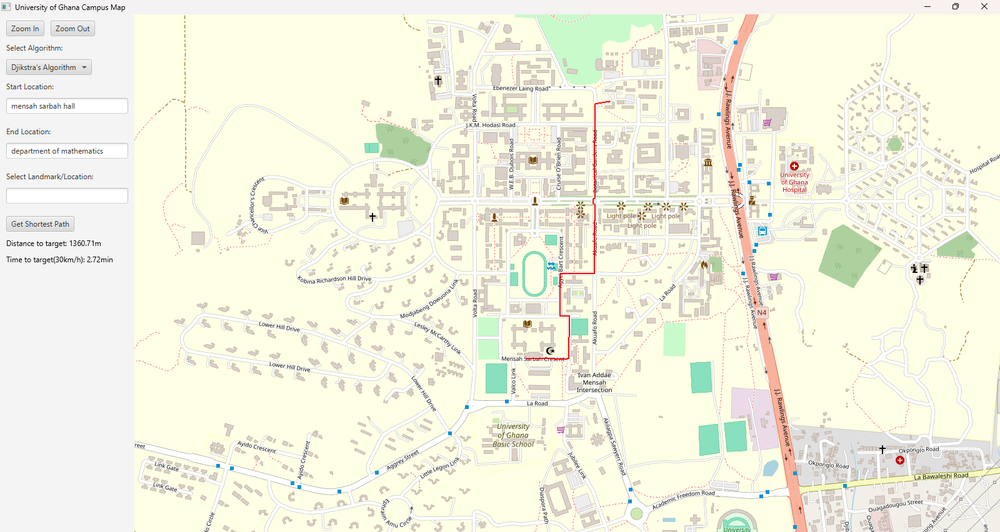

# Shortest Path Finder University of Ghana - Legon Campus

This repository contains a Java application for finding the shortest path between locations on the University of Ghana campus. The project includes implementations of Dijkstra's and A* algorithms and a graphical user interface using JavaFX for map visualization. (Path finding is not a 100% accurate, accuracy depends on the edges and nodes csv files.)

## Features
- **Shortest Path Algorithms**: Implements Dijkstra's and A* algorithms for pathfinding.
- **Interactive Map**: Visualizes the campus map and displays the shortest path between selected locations.
- **CSV Integration**: Reads nodes and edges from CSV files for flexible and customizable graph data.
- **JavaFX GUI**: Provides an intuitive graphical interface for user interaction.

## Dependencies
This project uses Maven for dependency management. Required libraries include:
- **JavaFX**: For the graphical user interface.
- **JXMapViewer**: For map visualization.

## Setup and Installation
* Clone the repository:
   ```bash
   git clone https://github.com/jandoh07/shortest-path-finder-ug-campus.git
    ```
#### For intelliJ users:
1. Open the project in IntelliJ IDEA:
   - Click on `File` -> `Open` and select the project directory.
   - IntelliJ IDEA will automatically detect the pom.xml file and import the Maven project, downloading all necessary dependencies.
2. Build the project:
   - Once the project is opened, you may need to refresh the Maven project to ensure all dependencies are downloaded. You can do this by clicking on the Maven tool window (usually on the right side) and clicking the refresh icon.
   - Alternatively, you can build the project by going to Build > Build Project from the menu.
3. Run the application:
    - Open the `Main` class and run the application.
    - Alternatively you can locate your main Java class (e.g., App.java) in the Project tool window and right-click on App.java and select Run 'App.main()' to execute your application directly from the IDE.
#### For Eclipse users:
1. Open Eclipse IDE:
   - Launch Eclipse and select a workspace where you want to store your Maven project.
2. Import the project:
    - Click on `File` -> `Import` and select `Existing Maven Projects`.
    - Browse to the directory where you cloned the repository and click `Finish`.
3. Build the project:
    - Right-click on your project in the Project Explorer and select Run As > Maven install to download dependencies and build your project.
4. Run the application:
    - Locate the main Java class (e.g., App.java) in the Project Explorer, right-click on it, and select Run As > Java Application to execute your application.

## Usage
1. Launch the application.
2. Select starting and destination locations on the campus map.
3. Choose the desired algorithm (Dijkstra's or A*).
4. View the shortest path highlighted on the map.

## Screenshot


## Disclaimer
Path finding is not a 100% accurate, accuracy depends on the edges and nodes csv files.

## License
This project is licensed under the MIT License. See the [LICENSE](LICENSE) file for details.

   